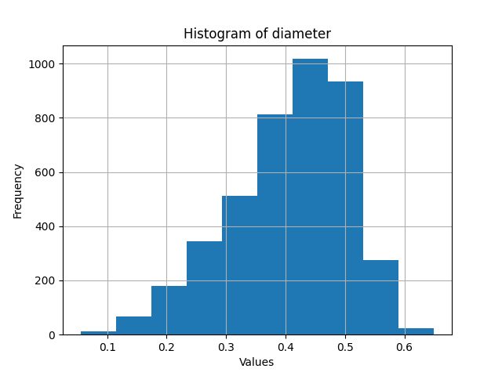
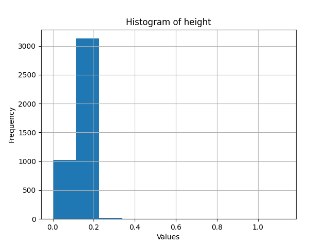
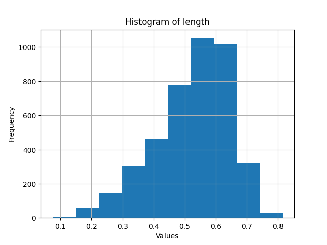
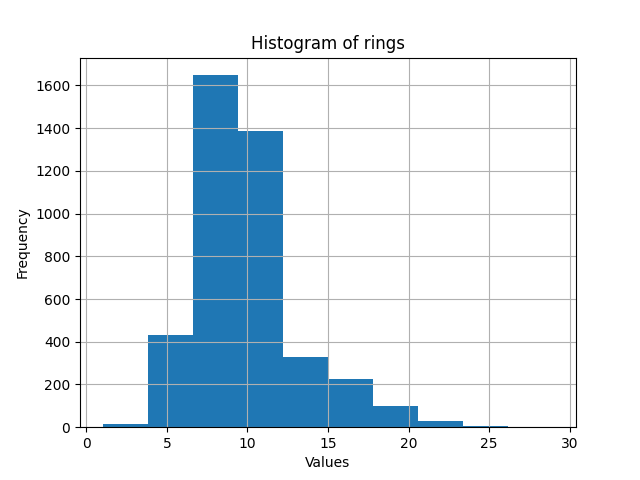
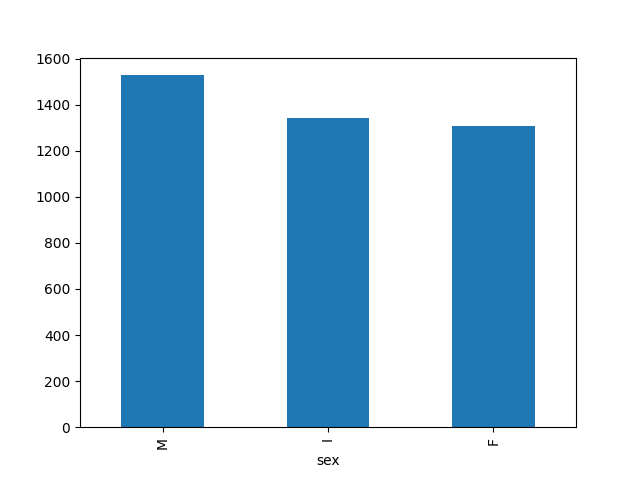
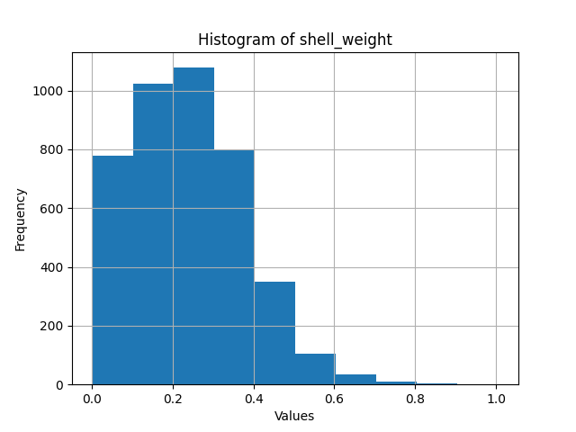
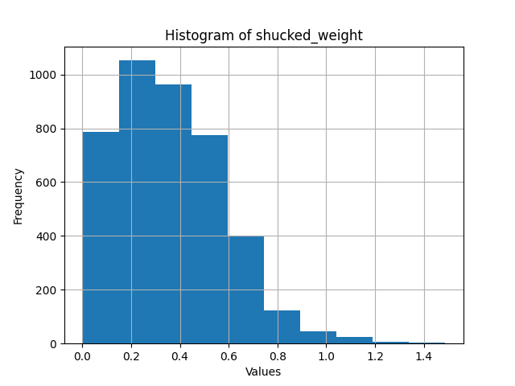
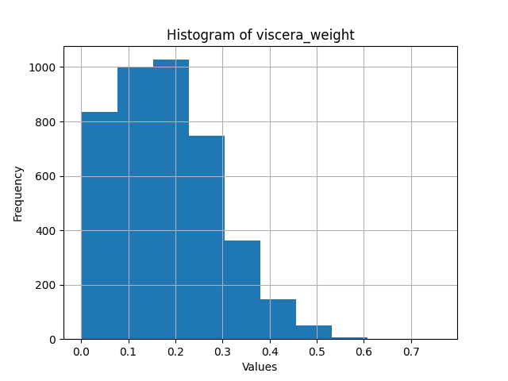
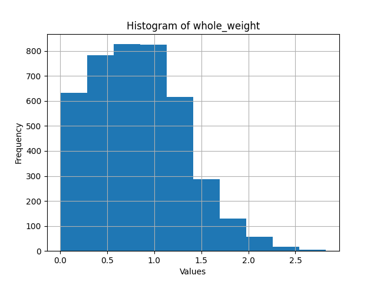

<h1 align="center">
  Python Machine Learning
</h1>

1. [Introduction](#introduction)
2. [Description of the research set](#description-of-the-researc-set)
3. [Data preprocessing](#data-preprocessing)
  1. [Histograms](#histograms)
  2. [Outliears](#outliears)
  3. [Transforming categorical data into numerical data](#transforming-categorical-data-into-numerical-data)
  4. [Labels and estimators](#labels-and-estimators)
  5. [Standardization and normalization](#standardization-and-normalization)
  6. [Performance metrics for regression models](#performance-metrics-for-regression-models)
  7. [Division of the set](#division-of-the-set)
4. [Building a regression model](#building-a-regression-model)
  1. [Linear Regression](#linear-regression)
  2. [MLP (Multilayer Perceptron)](#mlp-multilayer-perceptron)
  3. [SVR (Support Vector Regressor)](#svr-support-vector-regressor)
  4. [Decision tree](#decision-tree)
  5. [Random forest](#random-forest)
  6. [Gradient boosting](#gradient-boosting)
5. [Conclusions](#conclusions)
6. [Literature and sources](#literature-and-sources)

# Introduction

This project focuses on leveraging the abalone dataset to train six distinct machine learning models. The abalone dataset, renowned for its diverse features related to abalone species, provides a rich foundation for developing and evaluating these models. The primary objective is to harness the dataset's information to enhance the predictive capabilities of the machine learning models.

The six machine learning models employed in this project are carefully chosen to cover a spectrum of algorithms, ensuring a comprehensive exploration of predictive techniques. Each model is tailored to handle specific aspects of the abalone dataset, contributing to a robust and versatile solution.

Throughout the project, the emphasis is not only on training the models but also on optimizing their performance. This involves fine-tuning hyperparameters, implementing feature engineering strategies, and employing cross-validation techniques to ensure the models generalize well to unseen data.

The dataset's attributes, such as the physical measurements of abalones, are carefully analyzed to extract meaningful insights. Feature importance and correlation analyses are conducted to better understand the impact of individual attributes on the models' predictions.

The project also includes a thorough evaluation phase, where the models' performance metrics are scrutinized to assess their accuracy, precision, recall, and other relevant metrics. This evaluation provides valuable feedback for refining and selecting the most effective models.

Furthermore, the project incorporates best practices in machine learning, including data preprocessing techniques to handle missing values or outliers, scaling features for better convergence, and addressing potential biases in the dataset.

The ultimate goal of this project is to not only build accurate machine learning models but also to gain a deeper understanding of the underlying patterns within the abalone dataset. By doing so, the project contributes to the broader field of machine learning and reinforces the significance of leveraging diverse datasets for comprehensive model training and evaluation.

# Description of the research set 

First of all, to conduct a study, you need to select a data set. Selecting the appropriate data set is an important step in the machine learning process. The choice of dataset can have a significant impact on the performance and generalization of a machine learning model. There are many different parameters and variables to consider when choosing. This includes the relevance of the data, the size of the database, the quality of the data, the presence or absence of any values, whether the learning will be supervised or unsupervised, etc.

This project will use a dataset with a decision attribute because supervised machine learning will be used. There are many different sources from which you can obtain a free database for research use. In the case of this project, such a database was a database called Abalone from [archive.ics.uci.edu/dataset/1/abalone](https://archive.ics.uci.edu/dataset/1/abalone).

Predicting the age of abalone from physical measurements. The age of an abalone is determined by cutting the shell through the cone, staining it and counting the number of rings under a microscope - a tedious and time-consuming task. Other measurements that are easier to obtain are used to predict age.

This database contains 9 attributes, 1 of which - Rings - is a decision attribute: either as a continuous value or as a classification problem. The entire set contains 4,177 records. Below is a table describing which attributes are presented in this database, their names, units and types. It is worth paying attention to the fact that there are no missing values in this database, which will definitely facilitate the process of processing this data.

# Data preprocessing

Data preprocessing in machine learning refers to the systematic and methodical manipulation of raw data before entering it into machine learning algorithms. This essential step involves cleaning, transforming, and structuring the data to improve its quality, fill in missing values, and ensure compatibility with the selected model, thereby optimizing the overall performance and reliability of the AI system during the training process.

## Histograms

Data preprocessing can start by creating various charts to visualize the data. This step is very important because it allows you to visually assess which parameters of a specific data set will be more or less important and which can be completely ignored.



















## Outliears

**Outlier** – in machine learning, an outlier refers to an observation or data point that deviates significantly from the majority of the data set. Outliers can introduce noise and distort overall patterns in the data, which can lead to inaccurate or biased models. Identifying and handling outliers is crucial during data pre-processing in machine learning to ensure that the model is trained on reliable and representative information. Techniques such as statistical methods, visualization, and mathematical models are used to detect and resolve outliers, which contributes to the reliability and accuracy of the AI system.

An example of such values may be human body temperature. For example, the body temperature of a living person cannot be lower than 0 or higher than 100 degrees Celsius. As mentioned above, such values may appear during incorrectly entered values or may be some kind of anomaly. An important explanation is that outliers are very context-dependent. This means that technically a person's body temperature can be lowered below 0 degrees Celsius or heated above 100 degrees Celsius, but these are unlikely to be normal values for a living person.

As mentioned above, charts may not be sufficient to provide the necessary information about outliers. To obtain information about the data network on which preprocessing takes place, there is a special method in the Pandas package used to read the data that allows you to obtain such information – `describe`.

```python
data = pd.read_csv(’abalone/abalone.data’, names=names)
print(data.describe().T) # T means transposition
```

```
                 count      mean       std     min     25%     50%     75%      max
length          4177.0  0.523992  0.120093  0.0750  0.4500  0.5450   0.615   0.8150
diameter        4177.0  0.407881  0.099240  0.0550  0.3500  0.4250   0.480   0.6500
height          4177.0  0.139516  0.041827  0.0000  0.1150  0.1400   0.165   1.1300
whole_weight    4177.0  0.828742  0.490389  0.0020  0.4415  0.7995   1.153   2.8255
shucked_weight  4177.0  0.359367  0.221963  0.0010  0.1860  0.3360   0.502   1.4880
viscera_weight  4177.0  0.180594  0.109614  0.0005  0.0935  0.1710   0.253   0.7600
shell_weight    4177.0  0.238831  0.139203  0.0015  0.1300  0.2340   0.329   1.0050
rings           4177.0  9.933684  3.224169  1.0000  8.0000  9.0000  11.000  29.0000
```

The so-called [**interquartile range (IQR)**](https://en.wikipedia.org/wiki/Interquartile_range) – is a statistical measure used to assess the spread or dispersion of a data set. This is especially useful for identifying and handling outliers. IQR is defined as the range between the first quartile (Q1) and the third quartile (Q3) of a data set. It works as follows:

1. **Q1 (first quartile)**: The value below which 25% of the data falls.
2. **Q3 (third quartile)**: The value below which 75% of the data falls.
3. **IQR = Q3 - Q1**: represents the distribution of the middle 50% of the data. A larger IQR indicates greater variability in the central part of the data set.
4. **Outliers**: Values below Q1 − 1.5 * IQR or above Q3 + 1.5 * IQR are often considered potential outliers.

The code implementing this mathematical function for the DataFrame data type in which the examined data set is stored will be presented and described below:

```python
def find_and_delete_outliers(df):
    numeric_columns = df.select_dtypes(include=[’float64’, ’int64’]).columns
    Q1 = df[numeric_columns].quantile(0.25)
    Q3 = df[numeric_columns].quantile(0.75)
    IQR = Q3 - Q1
    lower_bound = Q1 - 1.5 * IQR
    upper_bound = Q3 + 1.5 * IQR
    outliers_mask = ((df[numeric_columns] < lower_bound) | (df[numeric_columns] > upper_bound)).any(axis=1)
    return df[~outliers_mask]
```

First, this function retrieves the attribute names for all attributes that are numeric. Then, repeating the algorithm described above, the function counts the first quartile (*Q1*), the third quartile (*Q3*), and the value in between (*IQR*). Using these values, you can calculate the upper (*upper_bound*) and lower bounds (*lower_bound*), and then calculate which values lie outside these bounds (*outliers_mask*). Finally, this function returns the dataset excluding all outliers.

Additionally, this code could have been modified to also check the number of attributes for each record where an outlier was detected, but this was not necessary for this project.

Below, a fragment of the code that used the above function will be presented and described, along with the effect of how its result changes this data set:

```python
data = find_and_delete_outliers(data)
print(data.describe().T)
```

```
                 count      mean       std     min      25%     50%       75%      max
length          3783.0  0.520962  0.111547  0.2050  0.45000  0.5350   0.61000   0.7600
diameter        3783.0  0.404922  0.092295  0.1550  0.34500  0.4200   0.47500   0.6000
height          3783.0  0.137309  0.035302  0.0400  0.11000  0.1400   0.16500   0.2400
whole_weight    3783.0  0.791854  0.444751  0.0425  0.43275  0.7665   1.11700   2.1275
shucked_weight  3783.0  0.347372  0.203520  0.0170  0.18100  0.3270   0.49200   0.9600
viscera_weight  3783.0  0.173810  0.101334  0.0005  0.09050  0.1640   0.24400   0.4920
shell_weight    3783.0  0.226082  0.122821  0.0130  0.12500  0.2200   0.31475   0.6250
rings           3783.0  9.429289  2.330609  4.0000  8.00000  9.0000  11.00000  15.0000
```

It is immediately visible that the number of records decreased noticeably, but thanks to this operation, outliers were eliminated. Since the data set contains not only numerical but also categorical values, they require separate processing. It is this data that will be used directly to train the models.

## Transforming categorical data into numerical data

There is only one attribute used in the data set that requires changing it to numerical values - gender (sex). As mentioned at the very beginning, this attribute has only 3 values - M (male), F (female), I (infant). Basically, this procedure is very simple. Replaces label values that can be written with simple text or a number. For example, if we have three categories in this set: M, F, and I, then they will be assigned the numbers 0, 1 and 2, respectively. This transformation of categorical data into numerical data is used to be able to process them by the learning model machine. To implement this procedure, there is a method in the scikit-learn library called `LabelEncoder()`. In addition to this function, the `fit_transform()` function is also used - this method is used to find unique category labels in a column and convert them to consecutive integers. The code that was used to implement this procedure in this project will be presented below, along with an example of what the data looked like before and after the transformation:

```python
print('Before transformation:')
print(data.head()[’sex’])

sex_attribute_only = data[’sex’]
lbe = LabelEncoder()
data[’sex’] = lbe.fit_transform(sex_attribute_only)

print('After transformation:')
print(data.head()[’sex’])
```

```
Before transformation:
0    M
1    M
2    F
3    M
4    I
Name: sex, dtype: object

After transformation:
0    2
1    2
2    0
3    2
4    1
Name: sex, dtype: int64
```

## Labels and estimators

There are two types of variables in machine learning: labels (dependent variables) and estimators (independent variables):

- **Label (dependent variable)** – Labels, also known as target variables or dependent variables, represent the outcomes or responses that the machine learning model aims to predict. In supervised learning, models are trained on a data set that contains both input features and their corresponding labels. The model learns to map input features to associated labels during the training process.
- **Estimator (independent variable)** – This is data that is used as input to a machine learning model and is used to predict or classify a label.

To simplify the above, we can say that independent variables are used to predict the value of the dependent variable. Due to the fact that the project uses supervised learning, this dataset contains both independent and dependent variables. To train the model further, these variables need to be separated, which is what the following code does:

```python
label = data[’rings’]
estimators = data.drop(’rings’, axis=1)
```

**There is one important clarification regarding the terminology used**. Labels in supervised learning can be numerical, not just categorical. When the target variable that needs to be predicted is a continuous numeric value, the task is commonly referred to as a **regression** task, and when the label value is a categorical value, this machine learning supervision is called **classification**. Since in this case we will be trying to predict a numerical value, we will perform a regression.

## Standardization and normalization

When talking about the mechanisms used in machine learning, we cannot ignore the normalization and standardization processes. Normalization and standardization are pre-processing techniques used to scale and transform the features of a dataset, making them more suitable for various machine learning algorithms. These techniques help ensure that features are of similar scale, preventing some features from dominating others during the training process.

- **Normalization** – normalization, also known as min-max scaling, transforms the features of a data set into a specific range, usually 0 to 1.
- **Standardization** – standardization transforms the features of a data set so that their mean is 0 and the standard deviation is 1.

Below we will present 2 pieces of code that implement standardization and normalization, respectively. For this purpose, two functions from the `sklearn.preprocessing` package are used - `StandardScaler` and `MinMaxScaler`. The fit function is used to train the training data and then the transform function transforms the data using the above formulas.

```python
std_scaler = StandardScaler()
x_train_scaled = std_scaler.fit_transform(x_train)
x_test_scaled = std_scaler.transform(x_test)
```

```python
norm_scaler = MinMaxScaler()
norm_scaler.fit(x_train)
x_train_scaled = norm_scaler.transform(x_train)
x_test_scaled = norm_scaler.transform(x_test)
```

The use (or not) of standardization and normalization is a decision that depends largely on the context, the data set and the algorithm that will be used to process that data.
Normalization is used when we want to scale functions to a specific range (usually [0, 1] or [-1, -1]).

For example, standardization is used when features have different units or significantly different scales. Algorithms that rely on distance measures, such as kNN or support vector machines, often benefit from standardization.

Some algorithms, such as decision trees or random forest, are not sensitive to the scale of the functions. In such cases, normalization or standardization may not be necessary. If all objects are at a similar scale and the algorithm used is not scale sensitive, you may decide not to perform any transformation.

If we pay attention to what data is used in this data set, it can be concluded that in this case the best solution would be either to use normalization or to refuse to use both normalization and standardization due to the fact that the values of the attributes shoes are recorded in the same units of measurement, and the data has been previously processed to remove outliers. Anyway, for clarity, this project will use all 3 scenarios to be able to get as much data as possible to compare with each other.

## Performance metrics for regression models

When talking about tools for assessing the quality of a trained machine learning model, we cannot omit various metrics that will be used to assess the effectiveness of a given model, as well as to compare them with each other. The `sklearn` package already contains some functions that will be used to compare the performance of models. Speaking directly about the metrics themselves that will be used:

1. [**Mean Absolute Error (MAE)**](https://en.wikipedia.org/wiki/Mean_absolute_error) - mean absolute error is a measure of the average absolute differences between predicted and actual values. Represents the average absolute error between predicted and actual values. Lower MAE indicates better model performance.
2. [**Mean Squared Error (MSE)**](https://en.wikipedia.org/wiki/Mean_squared_error) - mean squared error measures the average of the squares of the differences between predicted and actual values. MSE penalizes larger errors more than smaller ones. It is widely used but sensitive to outliers.
3. [**Root Mean Squared Error (RMSE)**](https://en.wikipedia.org/wiki/Root-mean-square_deviation) - as the name suggests, mean square error is the square root of MSE. The main difference is the scale of both indicators. While MSE reports the mean square difference in the original units, RMSE scales it back to the original units by taking the square root. RMSE is often preferred for interpretation because it is expressed in the same units as the target variable, making it more directly comparable and easier to understand.
4. [**R-squared**](https://en.wikipedia.org/wiki/Coefficient_of_determination) - R-squared is a statistical measure that represents the proportion of the variance in the dependent variable explained by the independent variables in the model. R2 ranges from 0 to 1, where 0 means that the model explains no variance and 1 means a perfect fit. This is a relative measure of goodness of fit.

## Division of the set

The next important step is to divide the data set into 2 sets - a training set and a test set. As the names suggest, one of them is used to train the model and the other is used to validate, or test, train. There is a function in the python package `sklearn.model_selection` called `train_test_split`.

```python
x_train, x_test, y_train, y_test = train_test_split(estimators, label, test_size=0.2, random_state=42)
```

This function takes labels and estimators as arguments and returns an array of 4 elements. These 4 elements represent 2 pairs (dependent and independent variables), one pair is the training set and the other is intended for testing. You will notice that 2 additional arguments were also passed – `test_size` and `random_state`. The value of the `test_size` variable is used as a coefficient that tells us how much of the total data set should serve as the training data set, in this case it is 20%. `random_state` guarantees repeatability of results when the function is run multiple times with identical parameters.

# Building a regression model

Creating a regression model involves using training data to create a model that can predict the numeric value of a label for new data. The most important elements in this process are preparing appropriate training data and selecting the appropriate model to obtain the most accurate results. There are many different algorithms that can be used to train models, for example: linear regression, MLP (Multilayer Perceptron), SVR (Support Vector Regressor), decision tree, random forest, gradient boosting. All these models will be used and their results will be compared below.

The study of each model will be done in such a way that learning will take place without and with standardization and normalization, and using the functions and mechanisms described above, metrics will also be calculated, and finally a comparison will be made of all to identify the most effective learning model.

## Linear Regression

[**Linear regression**](https://en.wikipedia.org/wiki/Linear_regression) – is a supervised learning algorithm used to predict a continuous numerical output based on one or more input features. It assumes a linear relationship between the input features and the target variable. In other words, linear regression models the relationship as a straight line, which makes it simple and interpretable for regression tasks. Linear regression is widely used because of its simplicity and interpretability. It is suitable in cases where there is a linear relationship between the input features and the target variable. However, it may not work well when the relationship is highly non-linear or when there are complex interactions between features.

Below is the code that implements linear regression using the sklearn package. The linear regression function – `LinearRegression()` – is imported from a module called `sklearn.linear_model`. Then, using this function, an object is created to which the data used to train this model is transferred using the `fit()` function. Finally, the `predict()` function makes a prediction based on the trained model.

The last 4 lines are responsible for the metrics of this model and use the functions mentioned above based on the data of the trained model.

```python
lr = LinearRegression()
lr.fit(x_train, y_train)
y_pred = lr.predict(x_test)

mae_linear_regression = mean_absolute_error(y_test, y_pred)
mse_linear_regression = mean_squared_error(y_test, y_pred)
rmse_linear_regression = np.sqrt(mean_absolute_error(y_test, y_pred))
r2_linear_regression = r2_score(y_test, y_pred)
```

The results below represent the 3 scenarios described above, where preprocessing does not apply standardization and normalization respectively, only standardization is applied, and only normalization is applied.

```
# WITHOUT STANDARTIZATION AND NORMALIZATION
MAE - Linear Regression: 1.3145016470392747
MSE - Linear Regression: 2.8110763813111364
RMSE - Linear Regression: 1.1465171813101078
R2 - Linear Regression: 0.4867476457554023
```

```
# WITH STANDARTIZATION
MAE - Linear Regression: 1.314501647039274
MSE - Linear Regression: 2.8110763813111355
RMSE - Linear Regression: 1.1465171813101076
R2 - Linear Regression: 0.4867476457554025
```

```
# WITH NORMALIZATION
MAE - Linear Regression: 1.314501647039274
MSE - Linear Regression: 2.8110763813111355
RMSE - Linear Regression: 1.1465171813101076
R2 - Linear Regression: 0.4867476457554025
```

Comparing these results, it can be seen that the presence or absence of standardization or normalization has virtually no impact on the final result.

## MLP (Multilayer Perceptron)

[**MLP (Multilayer Perceptron)**](https://en.wikipedia.org/wiki/Multilayer_perceptron) – MLP stands for Multilayer Perceptron. It is based on a neural network with many hidden layers. The principle of operation of MLP is to transform the input data through hidden layers using an activation function to obtain results at the input layer.

MLPs are used for a variety of tasks, including regression and classification problems. MLPs are successful in solving complex problems due to their ability to capture complex patterns and relationships in data. However, their effectiveness may depend on factors such as the choice of architecture, hyperparameters, and the availability of sufficient labeled training data (MLP requires a large amount of data and a good selection of parameters).

As in the previous case, from the point of view of writing code, the principle of creating and training a model is the same. First, a function from the `sklearn` package – `MLPRegressor` is imported, which is called and returns an MLP object. You will notice that additional parameters have also been passed to this function, as will be described below:

- **hidden_layer_sizes** – this parameter specifies the number of hidden layers and the number of neurons in each hidden layer. The tuple (100, 50) defines two hidden layers containing 100 and 50 neurons, respectively.
- **max_iter** – this parameter controls the maximum number of iterations (epochs) for MLP training.
- **random_state** – guarantees repeatability of results when the function is run multiple times with identical parameters.

Then the training data is transferred and the model learns. The last 4 lines are responsible for the metrics of this model and use the functions mentioned above based on the data of the trained model.

```python
mlp_regressor = MLPRegressor(hidden_layer_sizes=(100, 50), max_iter=1000, random_state=42)
mlp_regressor.fit(x_train, y_train)
y_pred = mlp_regressor.predict(x_test)

mae_mlp = mean_absolute_error(y_test, y_pred)
mse_mlp = mean_squared_error(y_test, y_pred)
rmse_mlp = np.sqrt(mean_absolute_error(y_test, y_pred))
r2_mlp = r2_score(y_test, y_pred)
```

The results below represent the 3 scenarios described above, where preprocessing does not apply standardization and normalization respectively, only standardization is applied, and only normalization is applied.

```
# WITHOUT STANDARTIZATION AND NORMALIZATION
MAE - MLP Regression: 1.2440079333216199
MSE - MLP Regression: 2.583057904454966
RMSE - MLP Regression: 1.1153510359172218
R2 - MLP Regression: 0.5283797482609597
```

```
# WITH STANDARTIZATION
MAE - MLP Regression: 1.2840764767486326
MSE - MLP Regression: 2.8022280505624826
RMSE - MLP Regression: 1.1331709830156402
R2 - MLP Regression: 0.4883631929593396
```

```
# WITH NORMALIZATION
MAE - MLP Regression: 1.2508571784042306
MSE - MLP Regression: 2.6100917634605953
RMSE - MLP Regression: 1.1184172648900903
R2 - MLP Regression: 0.5234438483077595
```

## SVR (Support Vector Regressor)

[**SVR (Support Vector Regressor)**](https://en.wikipedia.org/wiki/Support_vector_machine) – SVR stands for support vector regression, which is a type of machine learning model used for regression tasks. It is a variation of support vector machines (SVMs) that are commonly used for classification tasks. SVR, like SVM, relies on the concept of support vectors to perform regression.

The basic goal of SVR is to predict a continuous output (target) variable based on input features. This is particularly useful for tasks in which the relationship between features and the goal is complex and non-linear.

Below is the code implementing the SVR model. Using a special function from the `sklearn` package - `SVR()` - a model object is created to which data for training is transferred, after which values are predicted and errors are calculated.

```python
svm = SVR()
svm.fit(x_train, y_train)
y_pred = svm.predict(x_test)

mae_svm = mean_absolute_error(y_test, y_pred)
mse_svm = mean_squared_error(y_test, y_pred)
rmse_svm = np.sqrt(mean_absolute_error(y_test, y_pred))
r2_svm = r2_score(y_test, y_pred)
```

The results below represent the 3 scenarios described above, where preprocessing does not apply standardization and normalization respectively, only standardization is applied, and only normalization is applied.

```
# WITHOUT STANDARTIZATION AND NORMALIZATION
MAE - Support Vector Regression: 1.3173245837846737
MSE - Support Vector Regression: 3.066676760421334
RMSE - Support Vector Regression: 1.1477476132777074
R2 - Support Vector Regression: 0.44007958038503603
```

```
# WITH STANDARTIZATION
MAE - Support Vector Regression: 1.2509778954340682
MSE - Support Vector Regression: 2.7161606719243903
RMSE - Support Vector Regression: 1.118471231384191
R2 - Support Vector Regression: 0.5040775595284396
```

```
# WITH NORMALIZATION
MAE - Support Vector Regression: 1.2619591968258368
MSE - Support Vector Regression: 2.780038941951695
RMSE - Support Vector Regression: 1.1233695726811532
R2 - Support Vector Regression: 0.4924145279955523
```

## Decision tree

[**Decision tree**](https://en.wikipedia.org/wiki/Decision_tree_learning) – is a supervised machine learning algorithm used for both classification and regression tasks. It works by recursively splitting a dataset into subsets based on the values of various features, ultimately making decisions or predictions on the leaves of the tree. Decision trees are a fundamental component of many ensemble learning methods, such as random forests.

Decision trees are easy to understand and interpret. The visual representation of the tree is intuitive and can be useful in explaining the decision-making process of the model, but it may be sensitive to small differences in the data and may overfit the training data. They may not capture complex relationships in the data compared to more advanced models.

Below is the code implementing the SVR model. Using a special function from the `sklearn` package - `DecisionTreeRegressor()` - a model object is created to which data for training is transferred, after which the values are predicted and errors are calculated. `random_state` guarantees repeatability of results when the function is run multiple times with identical parameters.

```python
dc = DecisionTreeRegressor(random_state=42)
dc.fit(x_train, y_train)
y_pred = dc.predict(x_test)

mae_dc = mean_absolute_error(y_test, y_pred)
mse_dc = mean_squared_error(y_test, y_pred)
rmse_dc = np.sqrt(mean_absolute_error(y_test, y_pred))
r2_dc = r2_score(y_test, y_pred)
```

The results below represent the 3 scenarios described above, where preprocessing does not apply standardization and normalization respectively, only standardization is applied, and only normalization is applied.

```
# WITHOUT STANDARTIZATION AND NORMALIZATION
MAE - Decision Tree: 1.6428807400066072
MSE - Decision Tree: 4.877766765774695
RMSE - Decision Tree: 1.28174909401435
R2 - Decision Tree: 0.10940688320171854
```

```
# WITH STANDARTIZATION
MAE - Decision Tree: 1.6484968615791213
MSE - Decision Tree: 4.905186653452263
RMSE - Decision Tree: 1.2839380287144397
R2 - Decision Tree: 0.10440050130573097
```

```
# WITH NORMALIZATION
MAE - Decision Tree: 1.6382556987115957
MSE - Decision Tree: 4.862570201519657
RMSE - Decision Tree: 1.2799436310680232
R2 - Decision Tree: 0.11218150449347075
```

## Random forest

[**Random Forest**](https://en.wikipedia.org/wiki/Random_forest) – is an ensemble learning method that combines the predictions of multiple decision trees to improve overall performance and reduce overfitting. It is a versatile and efficient algorithm used for both classification and regression tasks. The basic idea of Random Forest is to build a collection of diverse decision trees and aggregate their predictions to obtain more accurate and robust results.

Below is the code implementing the Random Forest model. Using a special function from the `sklearn` package – `RandomForestRegressor()` – a model object is created to which data for training is transferred, after which the values are predicted and errors are calculated.

```python
rf = RandomForestRegressor()
rf.fit(x_train, y_train)
y_pred = rf.predict(x_test)

mae_rf = mean_absolute_error(y_test, y_pred)
mse_rf = mean_squared_error(y_test, y_pred)
rmse_rf = np.sqrt(mean_absolute_error(y_test, y_pred))
r2_rf = r2_score(y_test, y_pred)
```

The results below represent the 3 scenarios described above, where preprocessing does not apply standardization and normalization respectively, only standardization is applied, and only normalization is applied.

```
# WITHOUT STANDARTIZATION AND NORMALIZATION
MAE - Random Forest: 1.2726924347538817
MSE - Random Forest: 2.7552652130822604
RMSE - Random Forest: 1.1281367092484322
R2 - Random Forest: 0.4969377685414831
```

```
# WITH STANDARTIZATION
MAE - Random Forest: 1.2821275189957053
MSE - Random Forest: 2.761277039973571
RMSE - Random Forest: 1.1323106989672513
R2 - Random Forest: 0.4958401162948951
```

```
# WITH NORMALIZATION
MAE - Random Forest: 1.2806078625702015
MSE - Random Forest: 2.767365906838454
RMSE - Random Forest: 1.1316394578531634
R2 - Random Forest: 0.494728397924715
```

## Gradient boosting

[**Gradient boosting**](https://en.wikipedia.org/wiki/Gradient_boosting) - is an ensemble learning technique for building predictive models, typically used for both classification and regression tasks. The basic idea of gradient boosting is to sequentially train a series of weak learners (usually in the form of decision trees) and combine their predictions in an additive manner. Unlike Random Forest, which builds trees independently, gradient boosting builds trees sequentially, each correcting the errors of the previous ones.

Below is the code that implements the gradient boosting model. Using a special function from the `sklearn` package – `GradientBoostingRegressor()` – a model object is created to which data for training is transferred, after which the values are predicted and errors are calculated.

```python
gbr = GradientBoostingRegressor()
gbr.fit(x_train, y_train)
y_pred = gbr.predict(x_test)

mae_gbr = mean_absolute_error(y_test, y_pred)
mse_gbr = mean_squared_error(y_test, y_pred)
rmse_gbr = np.sqrt(mean_absolute_error(y_test, y_pred))
r2_gbr = r2_score(y_test, y_pred)
```

The results below represent the 3 scenarios described above, where preprocessing does not apply standardization and normalization respectively, only standardization is applied, and only normalization is applied.

```
# WITHOUT STANDARTIZATION AND NORMALIZATION
MAE - Gradient Boosting: 1.2759527496992347
MSE - Gradient Boosting: 2.7525123453063114
RMSE - Gradient Boosting: 1.129580784937153
R2 - Gradient Boosting: 0.4974403930437282
```

```
# WITH STANDARTIZATION
MAE - Gradient Boosting: 1.2730176660538224
MSE - Gradient Boosting: 2.7401245453533263
RMSE - Gradient Boosting: 1.1282808453810702
R2 - Gradient Boosting: 0.49970218412562517
```

```
# WITH NORMALIZATION
MAE - Gradient Boosting: 1.2726979458733705
MSE - Gradient Boosting: 2.7329842129418345
RMSE - Gradient Boosting: 1.128139151821871
R2 - Gradient Boosting: 0.5010058813302447
```

# Conclusions

After receiving the test results of 6 models, we can draw some conclusions. To compare the performance of all 6 models in 3 different scenarios, the following algorithm was used: for each of the 3 preprocessing scenarios, the smallest error value and the largest R2 value were calculated for each of the 6 models. The name of this model is written in brackets on the right:

```
# WITHOUT STANDARTIZATION AND NORMALIZATION
Lowest MAE error: 1.2440079333216199 (MLP Regression)
Lowest MSE error: 2.583057904454966 (MLP Regression)
Lowest RMSE error: 1.1153510359172218 (MLP Regression)
Highest R2 score: 0.5283797482609597 (MLP Regression)
```

```
# WITH STANDARTIZATION
Lowest MAE error: 1.2509778954340682 (Support Vector Regression)
Lowest MSE error: 2.7161606719243903 (Support Vector Regression)
Lowest RMSE error: 1.118471231384191 (Support Vector Regression)
Highest R2 score: 0.5040775595284396 (Support Vector Regression)
```

```
# WITH NORMALIZATION
Lowest MAE error: 1.2508571784042306 (MLP Regression)
Lowest MSE error: 2.6100917634605953 (MLP Regression)
Lowest RMSE error: 1.1184172648900903 (MLP Regression)
Highest R2 score: 0.5234438483077595 (MLP Regression)
```

It may be noted that the results are not significantly different from each other and their significance differs at the level of error. However, it can be noted that, as predicted above, the models for scenarios without standardization and normalization, as well as with normalization alone, were the most accurate. As you can see, the standardization scenario is characterized by the highest error rates compared to the others, as well as the lowest R2, indicating how well this model fits.

In our case, we see that MLP regression is the most effective model, but it is worth paying attention to the fact that the effectiveness of some models depends largely on their configuration, as in the case of MLP, on the number of hidden layers and the number of neurons in these layers.

To sum up, the effectiveness of a machine learning model depends on many factors, including, among others, the configuration of the models used, the quality of the input data and the suitability of the selected hyperparameters. It is imperative to recognize the complex interplay of these elements because their collective impact significantly shapes overall performance. Careful consideration of these factors will become key to optimizing the results and ensuring its relevance.

# Literature and sources

1. Nash, Warwick, Sellers, Tracy, Talbot, Simon, Cawthorn, Andrew, and Ford, Wes. (1995). Abalone. UCI Machine Learning Repository. [https://doi.org/10.24432/C55C7W](https://doi.org/10.24432/C55C7W)

